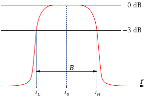

## Transformada de Fourier

La transformada de Fourier de una señal temporal se define matemáticamente como:

$$
\mathcal{F}\{x(t)\} = X(f) = \int_{-\infty}^{\infty} x(t) \, e^{-j 2 \pi f t} \, dt
$$

Esta fórmula nos permite convertir una señal temporal en una función de la variable f (frecuencia) de modo que podemos recuperar la señal original en cualquier momento (transformada inversa) pero también podemos estudiar la señal a partir de su transformada como si se tratara de una representación alternativa igualmente válida.

En telecomunicaciones es muy habitual referirse a las señales y a sus propiedades en el dominio de la frecuencia (pensando en la transformada de Fourier o “espectro” de la señal y no en su forma de onda). Por ejemplo podemos oír hablar de:

- **Banda de paso:** intervalo o rango de frecuencias en que la transformada de Fourier es distinta de cero.
- **Ancho de banda:** anchura (en unidades de frecuencia) de la banda de paso.
- **Frecuencia central:** punto medio de la banda de paso.

  

    
  

