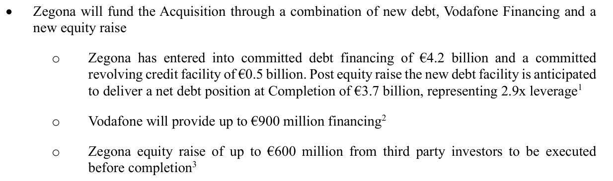
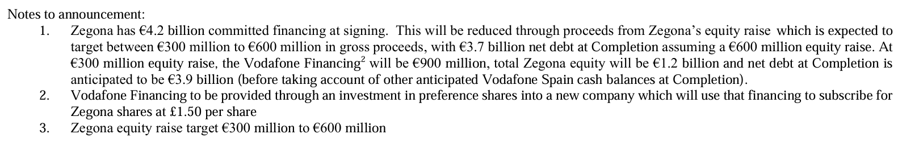
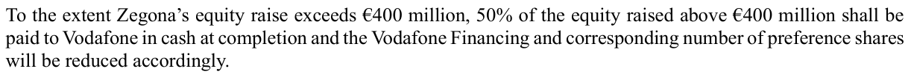
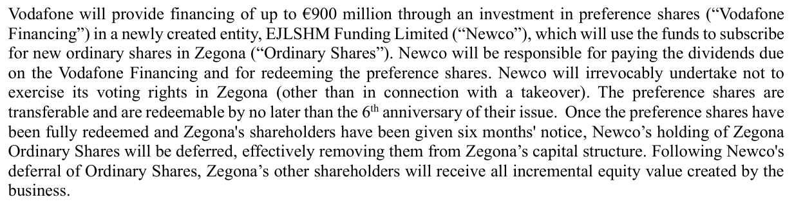
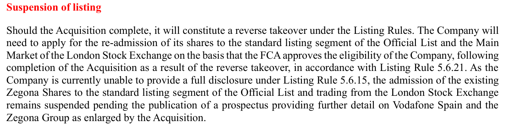
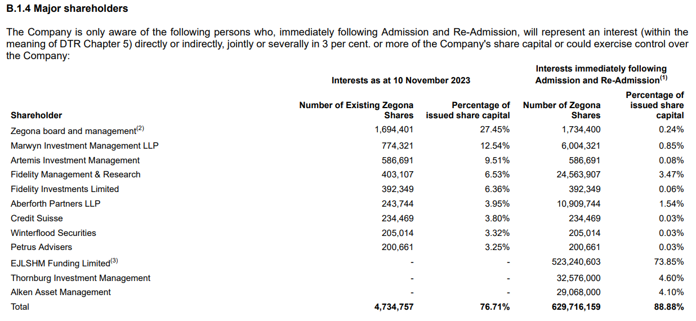
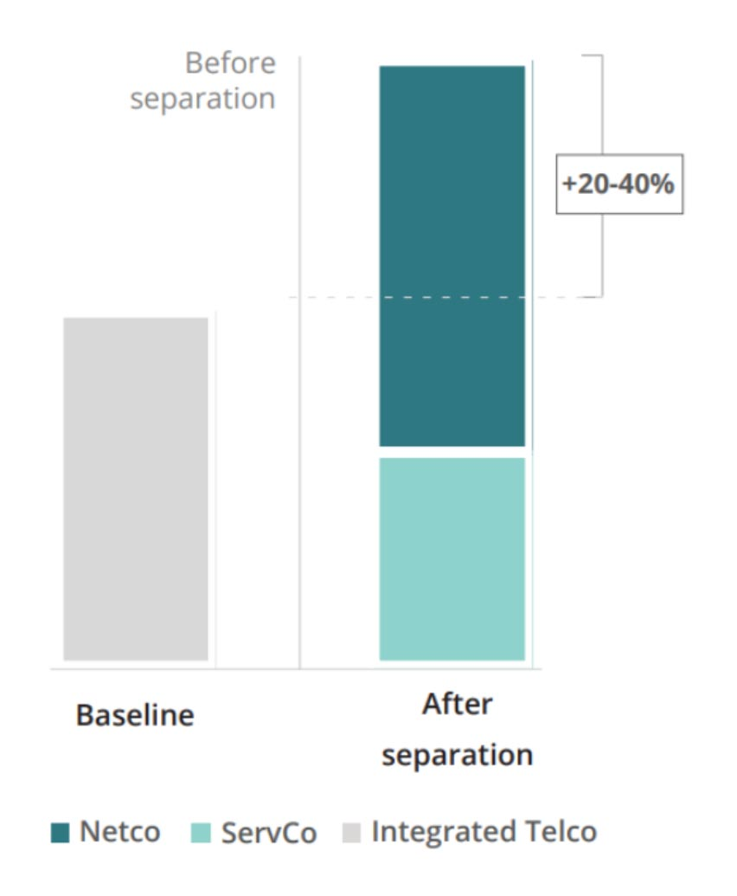

<table style="width:75%">
  <tr>
    <th>Bolsa</th>
    <td>LSE (London Stock Exchange)</td>
  </tr>
  <tr>
    <th>Ticker</th>
    <td>ZEG</td>
  </tr>
  <tr>
    <th>Web</th>
    <td><a href="https://www.zegona.com/investor-relations" target="_blank">Zegona Communications - Investor Relations</a></td>
  </tr>
</table>

## Resumen

Zegona Communications Plc (ZEG), listada en la bolsa de Londres (LSE) es un vehículo de inversión con propósito especial que está llevando a cabo una estrategia de *leveraged buyout* (LBO) sobre la filial en España del grupo Vodafone (Vodafone Group Plc): Vodafone España. El leverage buy out (o LBO) consiste en la adquisición de una compañía utilizando un elevado nivel de deuda (*acquisition debt* o deuda de adquisición), reduciendo con ello el compromiso de recursos propios (*equity*) por parte del comprador. **Al reducir el *equity* invertido, las tasas de retorno (ROE) son mucho más altas**.

La estrategia de *leveraged buyout* (LBO) sobre Vodafone España es particularmente interesante por los siguientes motivos:
- **Gestón creíble con éxitos repetidos**. Los fundadores de Zegona son ejecutivos experimentados (*seasoned*) del sector de las telecomunicaciones (*telecom space*) que ya han sido capaces de generar retornos atractivos a sus accionistas en 2 ventas (*exits*) anteriores dentro del mercado de telecomunicaciones de España. También han nombrado como CEO de Vodafone España a una destacada figura (*all-star*) que fue clave en su venta más reciente. Dado que gran parte de la creación de valor en un LBO depende de la ejecución, contar con un equipo que ya ha logrado esto no una, sino dos veces, en el mismo país y sector, genera mucha confianza.
- **Estructura de capital única, atractiva y malinterpretada**. Como en cualquier LBO, Zegona utilizó una gran cantidad de apalancamiento (*leverage*) para financiar la adquisición. De hecho, solo aproximadamente el 6% del precio de adquisición de 5.000 millones de euros, es decir, 300 millones, se financió con capital propio (*funded with equity*). El resto, 4.700 millones, se cubrió con deuda, incluyendo 900 millones de euros en financiación por parte del mismo vendedor o *vendor take-back financing* estructurada de una forma poco común e ingeniosa que añade un importante potencial de apalancamiento a la operación. Desde un punto de vista contable, esta financiación del vendedor parece haberse satisfecho mediante la emisión (*issuance*) de 900 millones de euros en acciones ordinarias (*common stock*). Se trata de acciones preferentes que representan aproximadamente el 69% del total de acciones ordinarias en circulación (*total commons outstanding*). Sin embargo, estas acciones son rescatables a la par (900 millones de euros) más los intereses acumulados (*accrued interest*), por lo que en la práctica se asemejan más a un instrumento de deuda/interés preferente (asumiendo que pueden ser rescatadas). Por tanto, Zegona puede "recomprar" el 69% de su actual capitalización bursátil contable de 2.400 millones de libras esterlinas (es decir, 1.670 millones de libras), por solo aproximadamente 750 millones de libras (900 millones de euros). Es como un *buyback* muy por debajo del precio de mercado. Esto permitirá una reducción de deuda muy acelerada.
- **Venta de activos rentables para reducir deuda**. La reducción de deuda parece excelente pero, ¿cómo se logrará?. La respuesta está en la monetización de la red de fibra propiedad de Vodafone. Zegona, siguiendo una estrategia (*playbook*) cada vez más común en el sector de telecomunicaciones, ya ha realizado los primeros pasos para hacer un *spinf-off* de su red de fibra mediante la integración de estos activos en empresas conjuntas (*joint ventures*) con las dos principales telecos de España (Telefónica y MásOrange). Eventualmente (y esperemos que pronto), Zegona planea vender su participación en estas *netcos* a inversores en infraestructuras, lo que, dado el alto valor que alcanzan estos activos (el múltiplo al que se pagan), será altamente rentable y debería generar los fondos suficientes para una significativa reducción de deuda, incluida la redención o cancelación de las ya mencionadas acciones preferentes.
- **Valoración inicial atractiva**. Vodafone Group Plc estaba muy endeudada (o apalancada), por lo que estaba interesada en desprenderse de su segmento español, no esencial en su negocio, a bajo precio. Zegona compró Vodafone España a un múltiplo entre 3.9x [[EBITDAaL]] ([según Zegona](https://otp.tools.investis.com/clients/uk/zegona/rns/regulatory-story.aspx?cid=1048&newsid=1826662&culture=en-GB&val=638805791190888876)) y 5.3x [[EBITDAaL]] ([según Vodafone Group Plc](https://www.vodafone.com/news/corporate-and-financial/sale-of-vodafone-spain)). En cualquier caso, incluso a un múltiplo 5x, esta valoración es la más baja pagada por una gran teleco española en los últimos 10 años.  Teniendo en cuenta la cantidad de apalancamiento (*leverage*) involucrado en la operación, cualquier pequeño aumento del múltiplo (*re-rating*) tiene un enorme potencial (*upside*). Aunque el precio actual de 5,75 £/acción implica un precio superior al  precio de adquisición de 1,50 £/acción, todavía estamos pagando un múltiplo bajo, especialmente si tratamos correctamente las acciones preferentes como deuda.
- **Potencial de *multi-bagger***. La combinación de reducción de deuda (*deleveraging*), monetización de las netcos y mejora de la rentabilidad operativa de la compañía (*opco*=*operating company*) tiene un potencial (*upside*) de revalorización de las acciones de la compañía del 300% o superior.

En resumen, Zegona está ejecutando un LBO muy agresivo sobre Vodafone España, con:
-  Un equipo gestor top.
- Compra barata.
- Posibilidad realista de reducir deuda masivamente.
- Y una estructura financiera que puede generar un retorno enorme si se aprovecha bien.

Existen 4 líneas de actuación que permitirían un incremento en la cotización:
1. *Deleveraging* vía monetización de activos (mismo EV, menos deuda → más *equity*): Si venden activos (como la red de fibra) y usan ese dinero para amortizar deuda, al mismo tiempo que el el *Enterprise Value* (EV) se mantiene constante (o casi), el *equity* se lleva lo que pierde la deuda. Como consecuencia, el *market cap* aumenta y, si el número de acciones se mantiene constante, sube el precio por acción.
2. Recompra de preferentes (mismo EV, mismas deudas, menos acciones → más valor por acción): Si usan el dinero para redimir las acciones preferentes, al mismo tiempo que el *Enterprise Value* (EV) se mantiene constante (o casi), no cambia la deuda pero el número de acciones en circulación disminuiría fuertemente (hasta un 69%). Como consecuencia, el *market cap* se reparte entre menos acciones y sube el precio por acción.
3. Mejora del [[EBITDAaL]] (mejora operativa): Si consiguen mejorar márgenes, recortar costes, renegociar torres, etc., el [[EBITDAaL]] subirá. A igual múltiplo, el EV tiene que subir. Si la deuda se mantiene constante, todo el incremento se traslada al *equity*. Como consecuencia, el *market cap* aumenta y, si el número de acciones se mantiene constante, sube el precio por acción.
4. *Re-rating* de múltiplo (mercado paga más por cada € de EBITDA): Si el mercado empieza a valorar a Zegona por ejemplo, a 6x [[EBITDAaL]] en lugar de 3.9x, al mismo tiempo que el [[EBITDAaL]] se mantiene constante, el *Enterprse Value* (EV) subirá. Si la deuda no sube, todo el incremento se traslada al *equity*. Como consecuencia, el *market cap* aumenta y, si el número de acciones se mantiene constante, sube el precio por acción.

Sin embargo, monetizar activos no es gratis: se pierde el control sobre una fuente de EBITDA y se pasa a tener un gasto. El balance óptimo es:
- Vender activos a múltiplos mucho más altos que el que está cotizando.
- Usar el dinero para amortizar deuda cara o redimir preferentes
- Evitar una caída fuerte del EBITDA neto (renegociando buenos *leases*, por ejemplo)
- Acompañar todo esto de mejoras operativas internas para volver a subir el EBITDA desde la nueva base.

Según *Horos Asset Management* (febrero 2025): *"A pesar de que la compañía ha subido más de un 80% en bolsa desde mayo, creemos que el potencial sigue siendo enorme, superior al 70%."*

## Historia

Zegona fue fundada en 2015 por dos antiguos ejecutivos de *Virgin Media*, Eamonn O'Hare y Robert Samuelson. que desempeñaron un papel fundamental en la transformación de la compañía y en su posterior venta a *Liberty Global* por 25.000 millones de dólares. Zegona se consituye con la intención de seguir una estrategia de Comprar-Arreglar-Vender utilizando apalancamiento (*Buy-Fix-Flip*/*LBO*) teniendo como objetivo compañías europeas del sector de las telecomunicaciones (*TMT: Technology, Media, and Telecommunications*).

	

En agosto de 2015 [Zegona compró la compañía de cable asturiana Telecable por 640 millones de euros](https://www.lavanguardia.com/economia/20150727/54433622293/zegona-compra-telecable.html). En mayo de 2017 [Telecable fue vendida a Euskaltel por 701 millones de euros](https://www.expansion.com/empresas/tecnologia/2017/05/16/591a95cd468aebbe0c8b45b6.html) combinando efectivo y acciones de forma que, como consecuencia de esta venta, Zegona se convirtió en propietaria del 15% de Euskaltel. Posteriormente, Zegona incrementó su posición hasta el 21% llegando a ser el máximo accionista de la compañía, con dos asientos en el consejo.

Zegona implementó cambios importante en Euskaltel. Los cambios más importantes fueron nombrar CEO a José Miguel García, antiguo CEO de Jazztel y actual CEO de Vodafone España, asociarse con *Virgin Media* y una reducción del 40% en los costes operativos de la empresa (20% del *cash flow*) desde 2018 hasta la primera mitad de 2020.

	

En 2021, [Euskaltel fue vendida al operador español MásMóvil por 3.500 millones de euros](https://www.zegona.com/~/media/Files/Z/Zegona/press-release/21-03-29-zeg-masmovil-euskaltel-offer.pdf). En total, Zegona generó un rendimiento del 87% sobre el capital invertido a través de estas transacciones. Tras esta venta, Zegona devolvió el capital a sus accionistas mediante una oferta de recompra y la directiva comenzó a buscar su próximo objetivo. Este nuevo objetivo terminó siendo Vodafone España.

## Adquisición de Vodafone

La compra de Vodafone España se estructura como una operación de *reverse takeover* (RTO) o *reverse IPO*. Un **reverse takeover (RTO)** o **adquisición inversa** es una operación financiera en la que **una empresa privada adquiere una empresa pública** con el objetivo principal de **cotizar en bolsa sin pasar por una salida a bolsa (IPO) tradicional**.

### Financiación

En [octubre de 2023](https://www.zegona.com/~/media/Files/Z/Zegona/press-release/2023/23-10-31-zegona-acquistion-of-vodafone-spain.pdf), Zegona llegó a un acuerdo para comprar Vodafone España por 5.000 millones de euros (3,9x FY23 [[EBITDAaL]]). En el acuerdo se indica que la financiación se estructuraba como una combinación de:
- **Nueva deuda**: 4.200 millones de euros junto 500 millones en forma de crédito *revolving*. En el momento de firmar el acuerdo, Zegona ya tenía asegurado un paquete de financiación de €4.200 millones (esto incluye deuda bancaria y otras fuentes). Si la ampliación de capital alcanza los 600 millones de euros, se utilizará una parte de ellos para reducir la deuda neta hasta 3.700 millones de euros. Esto se corresponde con un apalancamiento o *leverage* de 2,9x EBITDAal. Si la ampliación de capital se queda en 300 millones de euros, entonces la deuda neta se reducirá solamente hasta 3.900 millones de euros (3x [[EBITDAaL]]).
- **Financiación por parte de Vodafone Group**: 900 millones de euros. Estos 900 millones los proporcionará Vodafone Group (Vodafone financia a Zegona la compra de Vodafone España) en forma de acciones preferentes en el caso de que la ampliación de capital sea de 300 millones. Esta financiación se realizará de la siguiente forma: Vodafone Group Plc invierte 900 millones de euros en acciones preferentes de una sociedad nueva (EJLSHM Funding Limited) y esa sociedad es la que usa los 900 millones de euros para comprar acciones ordinarias de Zegona a 1.50 libras esterlinas.
- **Ampliación de capital (*equity raise*)**: El objetivo es conseguir entre 300 y 600 millones de euros. Si la ampliación de capital supera los 400 millones de euros, el 50% de la *equity* captada por encima de 400 millones de euros se pagarán a Vodafone Group Plc quien, a su vez, reducirá la parte correspondiente de las acciones preferentes compradas. Por tanto, si la ampliación de capital es de 600 millones de euros, 50%·(600-400)=100 millones de euros irán a Vodafone Group Plc, quien reducirá la financiación hasta 800 millones. Esta es la razón de que, tras una hipotética ampliación de capital de 600 millones, la deuda neta sea de 4.200-(600-100)=3.700 millones de euros.

	

	

	

La financiación por parte de Vodafone Group Plc merece un análisis más detallado:

	

1. En primer lugar, se ha creado una sociedad intermedia, EJLSHM Funding Limited, denominada *Newco* en la documentación de Zegona.
2. En segundo lugar, Vodafone Group Plc compra **acciones preferentes redimibles** de la *Newco* por valor de 900 millones de euros. La *Newco* dispone de 6 años para cancelar las preferentes.
3. En tercer lugar, la *Newco* usa los 900 millones para comprar acciones de Zegona a 1,50 libras esterlinas en la ampliación de capital (*equity raise*). 
4. Vodafone Group Plc posee indirectamente la mayor parte de las acciones de Zegona. Sin embargo, la *Newco* es controlada por Zegona y podrá cancelar las preferentes devolviendo los 900 millones de euros a Vodafone Group Plc.
5. Zegona puede pagar un dividendo de 1,50 libras esterlinas por acción a todos los accionistas, de manera que la *Newco* obtenga 900 millones en dividendos y pueda cancelar las preferentes.
6. Al redimir o cancelar las preferentes, las acciones de la *Newco* se cancelarán de la estructura de capital de Zegona. De esta forma, el resto de accionistas de Zegona pasarán automáticamente a ser propietarios del 100% de la compañía.

Por otro lado, al tratarse de una operación de *reverse takeover* que cambia la naturaleza y el tamaño de la empresa (pasa de ser una empresa pequeña y sin operaciones a controlar un activo enorme), la bolsa de Londres (LSE) suspende temporalmente la cotización para proteger a los inversores. Necesitan presentar un *prospectus* con toda la información detallada y transparente sobre la operación. Una vez aprobado por la [*Financial Conduct Authority* (FCA)](https://data.fca.org.uk/#/homepage), Zegona podrá solicitar que sus acciones sean readmitidas a cotización.

	

El [*prospectus*](https://www.zegona.com/~/media/Files/Z/Zegona/press-release/zegona-communications-plc-prospectus.pdf) contiene toda la información sobre la operación. Se trata de un documento de 250 páginas que permite que cualquier posible inversor pueda tomar una decisión informada. La primera parte, *PART I*, es un resumen (*summary*) de todos los apartados del documento. A continuación, se van a describir las secciones más destacadas de dicho resumen.

En primer lugar, se distingue entre las acciones anteriores a la adquisición de Vodafone España (*Existing Zegona Shares*) y las nuevas acciones que se emitirán para dicha operación (*New Zegona Shares*). En la siguiente tabla se muestran los principales accionistas antes de la adquisición y el accionariado tras la operación.

	

El consejo de Zegona, en la práctica, mantendrá el mismo número absoluto de acciones, por lo que reducirán enormemente su porcentaje, pasando de un 28% a un 0,25%. Esto es un aspecto negativo en relación al alineamiento de intereses entre directiva y accionistas. No obstante. existen fuertes bonificaciones para la directiva en caso de éxito con el objetivo de conseguir dicho alineamiento.

Por otro lado, aunque el CEO de Zegona seguirá siendo Eamonn O'Hare, la intención de Zegona es fichar a José Miguel García como CEO de Vodafone España (como así ocurrió al completar la adquisición).

En segundo lugar, se muestran las cuentas de Zegona y Vodafone España de los últimos 3 períodos financieros. Zegona no tiene ingresos, como cabe esperar. Sus costes son, básicamente, los salarios de los directivos. Por su parte, Vodafone España arrastra pérdidas anuales de entre 100-300 millones. 

En tercer lugar, se especifica el número de acciones que tendrá la compañía. El número de acciones nuevas (*New Zegona Shares*) que se emitirán es el siguiente:
- 697.654.138 acciones emitidas a 1.5 libras esterlinas, de las cuales 174.413.535 serán normales y 523.240.603 son de subscripción condicional (las de EJLSHM Funding Limited)
- 4.651.027 acciones emitidas posteriormente en la *PrimaryBid Offer*. Sin embargo, [la *PrimaryBid Offer* se lanzó el 13 de noviembre de 2023 y se completó el 15 de noviembre de 2023 con la emisión de 322.848 acciones nuevas](https://otp.tools.investis.com/clients/uk/zegona/rns/regulatory-story.aspx?cid=1048&newsid=1733613&culture=en-GB&val=638808507176391193).

![[ZEG_Prospectus_New_Zegona_Shares.png]]
![[ZEG_PrimaryBid_Offer_Results.png]]

Estas acciones hay que sumarlas a las acciones ya existentes (*Existing Zegona Shares*): 6.172.424.

![[ZEG_Prospectus_Existing_Zegona_Shares.png]]

**El total de acciones será la suma de las acciones existentes y las nuevas: 704.149.410.**

En cuarto lugar, se especifican las condiciones del *equity raise* con las *New Zegona Shares*:
- 174.413.535 acciones emitidas a 1,5 libras esterlinas (380% de prima sobre el precio a 22 de septiembre 2023, cuando se suspendió la cotización). Esto da lugar a 215 millones de libras.
- 900 millones de euros en la subscripción condicional con la *Newco* firmada el 31 de octubre de 2023. La *Newco* acuerda comprar acciones al precio de 1,5 libras esterlinas (tipo de cambio: 1 GBP = 1,1467 EUR).
- 8 millones de euros adicionales en una emisión adicional independiente denominada *PrimaryBid*. El [resultado de la *PrimaryBid Offer*](https://otp.tools.investis.com/clients/uk/zegona/rns/regulatory-story.aspx?cid=1048&newsid=1733613&culture=en-GB&val=638808507176391193). fue la captación de 484.272 libras esterlinas, muy por debajo de los 8 millones de euros que se buscaban.

![[ZEG_Prospectus_Terms_Conditions_Offer_edited.png]]

El apartado VII (*PART VII*) contiene los detalles sobre la transacción, entre los cuales interesa profundizar sobre la financiación. La deuda se divide en 3 préstamos:
1. *Term Loan A*: 500 millones de euros. La duración de este préstamo es de 5 años, con amortizaciones semestrales de la siguiente forma: ningún pago en los años 1 y 2, 2 amortizaciones del 12,5% del préstamo en los años 3 y 4 (25%+25%=50%) y 2 amortizaciones del 25% del préstamo en el año 5 (50%). El tipo de interés será EURIBOR+3,25%.
2. *Corporate Bridge Facility*: 3.700 millones de euros. Es un préstamo temporal de hasta €3.700 millones, que actuará como puente financiero hasta que Zegona consiga refinanciarlo con deuda a más largo plazo y en mejores condiciones. La duración es de 12 meses, con 2 opciones de extensión de 6 meses, es decir, 24 meses como máximo. No hay amortizaciones, por lo que se paga todo al final, pero con varios prepagos obligatorios si dan ciertos eventos, entre los cuales destaca que los primeros 300 millones de euros de la ampliación de capital (*equity raise*) debe utilizarse para amortizar este préstamo. Por tanto, el principal restante sería de 3.400 millones de euros. El tipo de interés será EURIBOR+2,00%.
3. *Revolving Credit Facility*: 500 millones de euros. Es una reserva de liquidez para necesidades futuras (si bajan ingresos, compras puntuales, pago de intereses, etc.). No se usa automáticamente, pero está disponible si la empresa lo necesita. Es más cara que otras fuentes de financiación (EURIBOR+2.75%), así que solo se usa si no hay otra opción mejor.

![[ZEG_Prospectus_Financing_Arrangements_New_Facilities.png]]

Por otro lado, también se incluyen un *covenant* financiero en cuanto al pago de dividendos (necesario para poder cancelar las acciones de la *Newco*). Se prohíbe el pago de dividendos salvo si se producen 3 eventos. Sin embargo, solo uno de ellos permitiría pagar el dividendo de 1,5 libras para que la *Newco* devuelva las preferentes: **ratio deuda/EBITDAaL por debajo de 2,25**.

![[ZEG_Prospectus_Financing_Arrangements_Dividends_Payment.png]]

Finalmente, se indican las características principales de las acciones preferentes que tendrá *Vodafone Group* sobre la *Newco*. No afectan a la financiación de la operación en sí, pero son fundamentales para entender cuánto tendrá que pagar la *Newco* para cancelarlas.

![[ZEG_Prospectus_Financing_Arrangements_Key_Terms_Vodafone_Preference_Shares.png]]

Las acciones preferentes deben reembolsarse en 6 años como máximo. Los intereses anuales devengados se pagarán en forma de dividendos al siguiente ritmo: 5% los años 1,2 y 3, 10% el año 4, 12,5% el año 5 y 15% el año 6. Por tanto, si Zegona quiere que la *Newco* cancele las preferentes el primer año, deberá añadir dichos intereses (5%·900=45 millones de euros) sobre el dividendo de 1,5 libras esterlinas. 

En su [informe anual de 2023](https://data.fca.org.uk/artefacts/NSM/Portal/NI-000098002/reports/213800ASI1VZL2ED4S65-2023-12-31-T01.xhtml) se pueden encontrar más detalles sobre la operación

Las [condiciones para la compra se alcanzaron el 14 de mayo de 2024](https://otp.tools.investis.com/clients/uk/zegona/rns/regulatory-story.aspx?cid=1048&newsid=1820151&culture=en-GB&val=638805791190898907). La compañía anuncia que cuenta con la aprobación del Consejo de Ministros, al tratarse de una operación de inversión extranjera en España. Se comunica además que la finalización de la operación está prevista para el día 31 de mayo de 2024 y que se ha solicitado a la bolsa de Londres la readmisión de las 704.149.410 acciones (*New Zegona Shares*) resultantes de la misma.

La [adquisición se completó el 31 de mayo de 2024](https://otp.tools.investis.com/clients/uk/zegona/rns/regulatory-story.aspx?cid=1048&newsid=1826662&culture=en-GB&val=638805791190888876). Este anuncio supone el final de la operación y en él se resumen las condiciones principales de la misma:
- La operación se completa por 5.000 millones de euros, lo que supone un múltiplo inferior a 4 veces su [[EBITDAaL]] de 2023. Se compara con la venta de Euskaltel, vendida a 10,2 veces [[EBITDAaL]] y la valoración de MásMóvil (8.7 veces [[EBITDAaL]]) y Orange (7.2 veces [[EBITDAaL]])
- 900 millones de euros, es decir, casi un 20% de la operación, los aporta *Vodafone Group*, es decir, el que vende se auto-paga parte de la operación.
- 3.900 millones de deuda (500 millones del Loan A + 3.700 millones del préstamo puente - 300 millones de la ampliación de capital), lo que supone un apalancamiento de 3 veces [[EBITDAaL]] de 2023.
- Vodafone España es un negocio atractivo y de escala, con un significativo potencial de generación de *cash flow*. Según las cuentas de 2023, sus ventas fueron de 3.900 millones de euros, su [[EBITDAaL]] fue de 1.300 millones de euros y generó un *cash flow* de 400 millones de euros.
- A partir del 1 de junio de 2024, José Miguel García será el CEO de Vodafone España, antiguo CEO de Euskaltel y Jazztel durante diferentes períodos. Euskaltel, compañía en la que Zegona contaba con una participación importante, fue reestructurada y transformada con tal éxito que MásMóvil la adquirió por 3.500 millones, generando un retorno del 87% para los accionistas de Zegona , En el caso de Jazztel fue capaz de multiplicar por 4 el tamaño de la compañía, que fue vendida posteriormente a Orange generando un retorno del 600%. Todo ello en 9 años (2006-2015).

### Refinanciación de deuda I

En [julio de 2024](https://data.fca.org.uk/artefacts/NSM/RNS/5263960.html) Zegona refinanció parte de su deuda. En concreto, la parte correspondiente al préstamo puente, es decir, los 3.400 millones de euros restantes tras usar los 300 millones de euros de la ampliación de capital para amortizar parte del mismo.

![[ZEG_Debt_Refinance_I.png]]

La deuda queda reestructurada de la siguiente forma:
- *Term Loan A*: 500 millones de euros.
- *6,75% Senior Secured Notes*: Son bonos denominados en euros por 1.300 millones de euros. Vencen en 2029.
- *8,625% Senior Secured Notes*: Son bonos denominados en dólares por 900 millones de dólares, que equivale a 828 millones de euros (cambio de 0,92 EUR/USD a 12 de julio de 2024). Vencen en 2029.
- *Euro Facility B*: Préstamo a 5 años por 920 millones de euros.
- *Dollar Facility B*: Préstamo a 5 años por 400 millones de dólares, que equivale a 368 millones de euros (cambio de 0,92 EUR/USD a 12 de julio de 2024).

La deuda total asciende a 3.916 millones de euros. Por tanto, se corresponde con la cantidad inicialmente adeudada con *Term Loan A* y *Corporate Bridge Facility* de 500+3.400=3.900 millones de euros.

**El objetivo de esta refinanciación es conseguir una financiación estable y de largo plazo**.

### Refinanciación de deuda II

En [marzo de 2025](https://otp.tools.investis.com/clients/uk/zegona/rns/regulatory-story.aspx?cid=1048&newsid=1913563&culture=en-GB&val=638806880518731143) Zegona refinanció por segunda vez parte de su deuda. En concreto, el préstamo *Term Loan B*, que asciende a 1.290 millones de euros.

![[ZEG_Debt_Refinancing_II.png]]

Esta refinanciación tiene 2 partes:
1. La parte en euros del *Term Loan B* (*Euro Facility B*) reduce su tipo de interés del 4,25% al 3% (125 puntos básicos menos) al mismo tiempo que su importe se extiende en 370 millones de euros, alcanzando los 1.290 millones de euros.
2. Se cancela la parte en dólares del *Term Loan B* (*Dollar Facility B*) con esos 370 millones de euros.

La deuda queda reestructurada de la siguiente forma:
- *Term Loan A*: 500 millones de euros.
- *6,75% Senior Secured Notes*: Son bonos denominados en euros por 1.300 millones de euros. Vencen en 2029.
- *8,625% Senior Secured Notes*: Son bonos denominados en dólares por 900 millones de dólares, que equivale a 828 millones de euros (cambio de 0,92 EUR/USD a 12 de julio de 2024). Vencen en 2029.
- *Term Loan B*: Préstamo a 5 años por 1.290 millones de euros a un interés anual del 3%.

La cantidad total adeudada se mantiene, en principio, en los mismos 3.900 millones de euros.

**El objetivo de esta refinanciación es reducir el tipo de interés en 125 puntos básicos para los préstamos por valor de 1.290 millones de euros**.

## Directiva

La directiva de Zegona está formada por las siguientes personas:
- Eamonn O'Hare (*Chairman* y CEO)
- Robert Samuelson (*Chief Operating Officer*)
- Ashley Martin (*Non-Executive Director*)
- Richard Williams (*Non-Executive Director*)
- Suzi Williams (*Non-Executive Director*)
- Sofia Arhall (*Non-Executive Director*). [Incorporada el 24 de abril de 2025](https://otp.tools.investis.com/clients/uk/zegona/rns/regulatory-story.aspx?cid=1048&newsid=1932828&culture=en-GB&val=638813164362745552).

En el caso de Vodafone España, su adquisición por parte de Zegona supuso una reestructuración de su directiva, que paso de 11 a 7 personas:
- José Miguel García (CEO): Antiguo CEO de Jazztel y Euskaltel.
- Ángel Álvarez (*Director of the Consumer Business Unit*): Antiguo *Chief Commercial Officer* de Digi España.
- José Ortiz Martínez (*Director of Legal and Regulation*): Antiguo *Legal Director* de Jazztel y Euskaltel.
- Berta Álvarez Stuber (*Director of Human Resources*): Antigua *Human Resources Director* de Euskaltel.
- Eloy Rodrigo Gil (*Finance Director*).
- Jesús Suso (*Director of the Enterprise Business Unit*).
- Julia Velasco (*Network Director*).

Como se puede comprobar, la nueva directiva de Vodafone España se compone de algunas de las personas que acompañaron a José Miguel García durante su etapa como CEO de Jazztel y Euskaltel. Por esta razón, es interesante analizar la exitosa inversión de Zegona en Euskaltel.

Por otro lado, Zegona cuenta con *management incentive arrangements* para alinear los intereses de la directiva con los de los accionistas.
### [Caso de estudio - Euskaltel](https://www.zegona.com/~/media/Files/Z/Zegona/documents/21-11-01-ekt-case-study-slide.pdf)

![[ZEG_Case_Study_Euskaltel.png]]

En agosto de 2015, Zegona completó la adquisición de Telecable, operador líder en Asturias, por un *enterprise value* de 640 millones de euros. En mayo de 2017, tras varias mejoras operativas, Telecable fue adquirida por Euskaltel (compañía cotizada) por un *enterprise value* de 701 millones de euros. Zegona recibió una parte en *cash*, que repartió entre sus accionistas, y otra parte en acciones de Euskaltel (15% del accionariado y un puesto en el consejo de la compañía).

En abril de 2019, Zegona incrementó su posición en Euskaltel hasta el 21%, captando e invirtiendo más de 100 millones de euros, lo que supuso que se convirtiese en el máximo accionista.

Antes de convertirse en máximo accionista, Euskaltel no había sido capaz de integrar correctamente sus adquisiciones, al mismo tiempo que los clientes bajaban, con la consiguiente pérdida de ingresos y rentabilidad. Zegona introdujo cambios fundamentales en la compañía en 3 niveles:
- Cambios en la directiva: José Miguel García, antiguo CEO de Jazztel, fue nombrado CEO junto con otros miembros de la antigua cúpula de Jazztel. Contaban con un *track-record* probado durante su etapa en Jazztel, donde fueron capaces de crear 2.800 millones de euros de valor que terminaron con la venta de Jazztel a Orange por 3.400 millones de euros en 2015. En Euskaltel, fue capaz de incrementar el [[EBITDAaL]] un 8% en los primeros 6 meses.
- Reducción de costes: Desde 2018 hasta la primera mitad de 2020 la nueva directiva consiguió un ahorro de 40 millones de euros, invirtiendo en digitalización, venta *online* así como la unificación en la gestión de las 3 marcas regionales (Euskaltel en País Vasco, R en Galicia y Telecable en Asturias).
- Expansión nacional: - Acuerdo con la marca *Virgin*, utilizada como oferta *premium* que coexistía con Euskaltel. Como resultado, pasaron de tener a 2,5 millones de hogares (*addresable premises*) en 2019, a más de 20 millones en 2021, es decir, se multiplicó por 8 el número de hogares.

En marzo de 2021, MásMóvil anunció una oferta para comprar Euskaltel por 3.500 millones de euros. La compra por parte de MásMóvil supuso un retorno del 87% en 6 años (2015-2021) para los accionistas de Zegona. En total, Zegona devolvió 335 millones de libras esterlinas a sus accionistas una vez completada la operación. Cabe mencionar que la inversión se vio beneficiada por movimientos en el cambio de divisa EUR/GBP.

### Esquema de incentivos para la directiva

Zegona cuenta un sistema de *Management Shares* para incentivar a su equipo directivo. Si los accionistas normales obtienen un retorno mínimo del 5% anual compuesto (*Preferred Return*) durante un período de cálculo (*Calculation Periods*) el equipo gestor se lleva un 15% del crecimiento del valor bursátil de la empresa en dicho período.

Este esquema se encuentra descrito en el apartado 8 del [*prospectus*](https://www.zegona.com/~/media/Files/Z/Zegona/press-release/zegona-communications-plc-prospectus.pdf) de la operación y en las [páginas 31-33 del informe anual de 2023](https://data.fca.org.uk/artefacts/NSM/Portal/NI-000098002/reports/213800ASI1VZL2ED4S65-2023-12-31-T01.xhtml).

Los períodos de cálculo duran entre 3 y 5 años. El último período, de 3 años, terminó el 14 de octubre 2024, tras el que se ha iniciado uno nuevo (terminará, cómo mínimo, en 2027).

La dirección puede cerrar el periodo voluntariamente entre el tercer y el quinto año, o este puede cerrarse automáticamente si hay:
- Disolución de la empresa.
- Venta mayoritaria de activos.
- OPA o cambio de control.

Al cerrar un período, y si se ha cumplido el *Preferred Return* del 5% anual compuesto, la dirección puede redimir (ejercer) sus *Management Shares*. Así, la directiva recibe el 15% del aumento en el valor de Zegona, ya sea en efectivo o en acciones ordinarias. Esto puede llevar a que la dirección se convierta en accionista significativa, si el valor creado ha sido grande. Si no se ha alcanzado el retorno del 5%, no se paga nada a la dirección.

Una vez redimidas, se inicia automáticamente un nuevo período de cálculo. Se vuelve a calcular el crecimiento desde un nuevo punto de partida (*Baseline*), que es el mayor entre el valor de mercado medio de 30 días (*30-day VWAP*) y el capital invertido neto por los accionistas en esa fecha.

Por otro lado, los accionistas tienen la última palabra para ratificar un nuevo período de cálculo. Si el 75% o más de los accionistas votan en contra, las *Management Shares* se cancelan sin valor.

En el último período (14 de octubre de 2021 - 14 de octubre de 2024), el crecimiento en el valor bursátil ha sido de 1.500 millones de libras esterlinas, siendo su capitalización superior a 2.500 millones de libras esterlinas. De esta forma, el crecimiento anualizado para los accionistas durante esos 3 años ha sido ampliamente superior al 5%. Así,  [el día 15 de octubre de 2024 la directiva ejerció sus *Management Shares*](https://otp.tools.investis.com/clients/uk/zegona/rns/regulatory-story.aspx?cid=1048&newsid=1875387&culture=en-GB&val=638808662814088075), recibiendo el 15% de dicho incremento en forma de 55 millones de acciones de Zegona de nueva emisión, lo que les convierte en propietarios del 7,5% de Zegona. En concreto, el número de acciones emitidas es 55.060.495. La directiva se compromete a mantener las acciones sin vender durante 2 años (2026). De esta forma, **el total de acciones de la compañía pasa a ser 759.209.905**. 

### Compra y venta de acciones

La directiva de Zegona ha comprado acciones desde el anuncio de la adquisición de Vodafone España:
- El [17 de noviembre de 2023](https://otp.tools.investis.com/clients/uk/zegona/rns/regulatory-story.aspx?cid=1048&newsid=1734139&culture=en-GB&val=638817233299524711) Richard Williams (*Non-Executive Director*) compró 26.666 acciones de la compañía ($ZEG) a un precio de 1,5 libras esterlinas por acción (39.999 libras esterlinas).
- El [17 de noviembre de 2023](https://otp.tools.investis.com/clients/uk/zegona/rns/regulatory-story.aspx?cid=1048&newsid=1734139&culture=en-GB&val=638817233299524711) Ashley Martin (*Non-Executive Director*) compró 13.332 acciones de la compañía ($ZEG) a un precio de 1,5 libras esterlinas por acción (19.998 libras esterlinas).
- El [17 de julio de 2024](https://otp.tools.investis.com/clients/uk/zegona/rns/regulatory-story.aspx?cid=1048&newsid=1843321&culture=en-GB&val=638817230643284616) José Miguel García (CEO de Vodafone España) compró 485.500 acciones de la compañía ($ZEG) a un precio de 2,653 libras esterlinas por acción (1.288.031,50 libras esterlinas).
- El [12 de noviembre de 2024](https://otp.tools.investis.com/clients/uk/zegona/rns/regulatory-story.aspx?cid=1048&newsid=1884062&culture=en-GB&val=638817229037796996) Richard Williams (*Non-Executive Director*) compró 82.141 acciones de la compañía ($ZEG) a un precio de 3,2 libras esterlinas por acción (174.076,80 libras esterlinas).
- El [12 de diciembre de 2024](https://otp.tools.investis.com/clients/uk/zegona/rns/regulatory-story.aspx?cid=1048&newsid=1893405&culture=en-GB&val=638817229037747012) Ashley Martin (*Non-Executive Director*) compró 13.332 acciones de la compañía ($ZEG) a un precio de 3,3 libras esterlinas por acción (42.075 libras esterlinas).
- El [13 de enero de 2025](https://otp.tools.investis.com/clients/uk/zegona/rns/regulatory-story.aspx?cid=1048&newsid=1900344&culture=en-GB&val=638817229037677001) Richard Williams (*Non-Executive Director*) compró 12.363 acciones de la compañía ($ZEG) a un precio de 4,0392 libras esterlinas por acción (49.936.63 libras esterlinas).

No se han registrado operaciones de venta hasta la fecha. Esto es un indicativo de la confianza de la directiva respecto a su plan estratégico, especialmente en el caso de José Miguel García, con más de 1,5 millones de euros de su patrimonio invertidos.

## Estrategia

La estrategia de la directiva para conseguir rentabilizar la operación de la adquisición de Vodafone España combina los siguientes elementos:
- Reducir la deuda para que, manteniendo el [[EBITDAaL]] y el múltiplo, el *market cap* se incremente.
- Reducir el número de acciones en circulación para que, manteniendo el [[EBITDAaL]] y el múltiplo (y sin incrementar la deuda), el *market cap* se reparta entre un número inferior de acciones, de forma que el precio por acción se incremente.
- Aumentar el [[EBITDAaL]] para que, manteniendo el múltiplo y sin incrementar la deuda, el correspondiente incremento del *Enterprise Value* se traslade al *market cap*.

Se han definido dos líneas de actuación:
- Reducción de la deuda y cancelación de las acciones preferentes (LBO) mediante la monetización de activos.
- Reestructuración del negocio (*turn around*).

### Reducción de deuda y cancelación de preferentes

La primera línea de actuación es la cancelación de las preferentes de Vodafone España. Para ello, es necesario emitir un dividendo a todos los accionistas de Zegona, de forma que la *Newco* sea capaz de devolver los 900 millones (más intereses) a *Vodafone Group Plc*. 

Sin embargo, es necesario recordar que existe un *covenant* financiero en la financiación de la adquisición que condiciona el pago de dividendos a un *leverage ratio* inferior a 2,25 veces. Esto supone que Zegona debe reducir la deuda de la compañía antes de repartir ese dividendo. 

Por tanto, se debe calcular la cantidad de dinero (*cash*) que debe generar la compañía para realizar ambos pagos. 

En primer lugar, podemos estimar el nivel de deuda que habilitaría el pago de dividendos a partir del importe de adquisición (5.000 millones de euros) y los múltiplos EV/EBITDAaL proporcionados por Zegona (3,9x EV/EBITDAaL) y *Vodafone Group* (5,3x EV/EBITDAaL) en el momento de adquisición:
- Escenario optimista (2023 EV/EBITDAaL=3,9): El EBITDAaL sería de 5.000/3,9=1.282 millones de euros, es decir, unos 1.300 millones de euros. Por tanto, el nivel de deuda neta que se puede alcanzar es de 2,25·1.300=2.925 millones de euros. Como la deuda neta resultante de la operación es de 3.900 millones de euros, se deberían pagar unos 1.000 millones de euros de dicha deuda.
- Escenario pesimista (2023 EV/EBITDAaL=5,3): El EBITDAaL sería de 5.000/5,3=943 millones de euros, es decir, unos 940 millones de euros. Por tanto, el nivel de deuda neta que se puede alcanzar es de 2,25·940=2.115 millones de euros. Como la deuda neta resultante de la operación es de 3.900 millones de euros, se deberían pagar unos 1.800 millones de euros de dicha deuda.

El *cash* necesario para cumplir con el *covenant* financiero oscila en un rango entre 1.000 y 1.800 millones de euros.

En segundo lugar, podemos estimar cuál debe ser el dividendo a repartir para que la *Newco* cancele las acciones preferentes con *Vodafone Group*. Se deben devolver los 900 millones de euros junto con los intereses de 1 año y medio (aproximadamente) del 5% anual, es decir, (5%+2,5%)·900 = 967 millones de euros (820 millones de libras esterlinas a marzo de 2025). Como la *Newco* dispone de 523.240.603 acciones, el dividendo debe ser de 820/523.240.603 = 1,57 libras esterlinas por acción. En principio, el dividendo debe repartirse a todos los accionistas, es decir, a las 759.209.905 acciones de circulación, de forma que el importe total del dividendo sería 1,57·759.209.905 = 1.191 millones de libras esterlinas (1.436 millones de euros a marzo de 2025).

El *cash* necesario para repartir un dividendo suficiente que cubra las acciones preferentes será de 1.400 millones de euros. 

En total, el *cash* necesario para cancelar las acciones preferentes será de entre 2.400 y 3.200 millones de euros.

No obstante, gracias a la primera refinanciación de deuda, en la que se emitieron bonos, la compañía se ha visto obligada a publicar información trimestralmente sobre el estado de su deuda así como algunos KPIs de Vodafone España. En concreto. el [20 de diciembre de 2024](https://otp.tools.investis.com/clients/uk/zegona/rns/regulatory-story.aspx?cid=1048&newsid=1895429&culture=en-GB&val=638818205566645333) publicó la información correspondiente hasta el 30 de septiembre de 2024 y el [24 de febrero de 2025](https://otp.tools.investis.com/clients/uk/zegona/rns/regulatory-story.aspx?cid=1048&newsid=1911500&culture=en-GB&val=638818205566565334) hizo lo propio con la información hasta el 31 de diciembre de 2024.

![[ZEG_KPIs_Sep_2024.png]]
![[ZEG_KPIs_Dec_2024.png]]

Estos documentos nos permiten obtener el EBITDAaL de Vodafone España en los últimos 9 meses de 2024. Si extrapolamos los datos al primer trimestre de 2024 mediante el mínimo de los 3 trimestres, ya que este tipo de empresas tienen ingresos muy estables y predecibles, podemos obtener el EBITDAaL del año 2024:
- Primer trimestre (*3m to March 24*): 299 millones de euros
- Segundo trimestre (*3m to Jun 24*): 299 millones de euros
- Tercer trimestre (*3m to Sep 24*): 318 millones de euros
- Cuarto trimestre (*3m to Dec 24*): 320 millones de euros
- **Total: 1.236 millones de euros**

Por otro lado, la deuda neta es de 3.800 millones, de forma que se necesitarían 3.800-2,25·1.236=1.019 millones de euros para cumplir con el *covenant* financiero, es decir, 1.000 millones de euros. Es importante tener en cuenta que cualquier pequeña variación en el EBITDAaL tiene un efecto importante en la cantidad de deuda a amortizar para cumplir con dicho *covenant*. Por ejemplo, si el EBITDAaL es 100 millones inferior, es decir, 1.100 millones de euros, la cantidad de deuda a amortizar sería de 3.800-2,25·1.100=1.325 millones de euros.

**Por tanto, parece que nos encontramos en el escenario optimista: la cantidad de *cash* a obtener para reducir la deuda y pagar el dividendo sería de 2.400 millones de euros.**

La gran pregunta es: **¿Cómo van a obtener los 2.400 millones de euros?**. La respuesta está en la **monetización de los activos de fibra**.

La industria de las telecomunicaciones tiende a atraer a muchos inversores en valor (*value investors*) por diversas razones, siendo quizás la principal que presenta características propicias para la ingeniería financiera (*financial engineering*) sofisticada y una asignación inteligente del capital (*capital allocation*). El mejor ejemplo de esto es John Malone y todo el valor que ha creado durante décadas con TCI y el grupo Liberty.

Una estrategia que se ha vuelto común para generar valor para los accionistas, especialmente en Europa, ha sido dividir las telecos verticalmente integradas en dos entidades: una que posee la infraestructura de red (*Netco*) y otra que ofrece servicios basados en esa infraestructura (*ServCo*). Esta estrategia (*playbook*) ha sido aplicada en varias ocasiones por John Malone en Liberty Global, así como en otras compañías, como es el caso de Euskaltel.

	

La motivación principal para hacer esto es, simplemente, que las partes suelen valer más que el todo. ¿Por qué? En primer lugar, porque la infraestructura de red es esencial, tiene altas barreras de entrada y altos costes de despliegue, y puede generar ingresos recurrentes tipo "peaje" con márgenes muy elevados. Por ello, las *Netco* pueden alcanzar valoraciones extremadamente altas, del orden de **15-25x EBITDA**, primas sustanciales respecto a las telecos integradas o las *ServCo*. Esto permite que una compañía que cotiza a 5 veces EBITDA pueda vender su activos a 15 veces.

La empresa resultante, la *ServCo*, está aceptando una cierta erosión de márgenes (ya que ahora la *ServCo* debe pagar por usar la infraestructura de red), a cambio de sacar mucho capital del negocio, lo que la convierte en una empresa más ligera en activos (*asset-light*) y en capex (*capex-light*), y con un **mayor retorno sobre el capital invertido (ROIC)**.

En este caso, Vodafone España cuenta con una extensa red de fibra (*fixed-line network*) propietaria, a diferencia de las estaciones base correspondientes a su red móvil, que ya fueron vendidas a KKR a través de la *Netco* Vantage Towers. En la página 51 del [*prospectus*](https://www.zegona.com/~/media/Files/Z/Zegona/press-release/zegona-communications-plc-prospectus.pdf) se puede encontrar información detallada sobre su red de fibra.

![[ZEG_ High-speed_fixed-line_gigabit_network.png]]

En concreto, Vodafone España da acceso a 10,7 millones de hogares en España a través de su red de fibra propietaria, que se desglosa en 3 tipos:
- HFC (*Hybrid Fiber-Coaxial*): 6,8 millones de hogares.
- FTTH (*Fiber To The Home*): 3,2 millones de hogares.
- Combinación de HFC y FTTH: 0,7 millones de hogares.

Por otro lado, Vodafone España llega a 18,3 millones de hogares adicionales utilizando redes de otros operadores como Telefónica, Orange y Adamo mediante acuerdos mayoristas. Esto es importante porque refuerza la idea de Zegona en cuanto a monetización de los activos de fibra.

En las página 55 y 56 del [*prospectus*](https://www.zegona.com/~/media/Files/Z/Zegona/press-release/zegona-communications-plc-prospectus.pdf) (noviembre de 2023) Zegona describe de forma explícita la estrategia de monetización de los activos de fibra.

![[ZEG_Implement_potential_fixed_line_Netco_transaction_(I).png]]
![[ZEG_Implement_potential_fixed_line_Netco_transaction_(II).png]]

Vodafone España tiene una red fija extensa con acceso a más de 28 millones de hogares en toda España (lo que representa aproximadamente el 95 % de los hogares, empresas y otras ubicaciones del país). Zegona ve una oportunidad potencial para monetizar la red propia de Vodafone España en el futuro. Dicha oportunidad podría adoptar las siguientes formas:
1. Venta a un inversor en infraestructuras. Por ejemplo, KKR o Pontegadea.
2. Una fusión con otro operador de red español existente, por ejemplo Telefónica o MásOrange.

Para que la red sea más atractiva para inversores, probablemente sería necesario actualizar la red de fibra de Vodafone para que sea completamente FTTH. Zegona estima este coste entre 600 y 700 millones de euros (75€ por hogar actualizado y 150€ por cliente migrado de HFC a FTTH).

Una vez actualizada, esa red valdría mucho más en forma de *Netco* frente a seguir dentro de Vodafone España en forma de *Integrated Telco*. Basándose en los múltiplos de EBITDA logrados en transacciones comparables:
- Suponiendo una cuota de acceso de la *Netco* de 10€ al mes por cliente y 1,8 millones de clientes *on-net* (Vodafone España tiene acceso a más de 28 millones de hogares, pero de ellos no todos son clientes y, de entre todos los clientes, solo 1,8 millones usan la red propiedad de Vodafone), la *Netco* tendría unos ingresos anuales (*revenues*) de 10€/mes · 12 meses · 1.800.000 clientes = 216 millones de euros.
- A estos ingresos añaden 20 millones de euros adicionales procedentes de otras fuentes, de forma que los ingresos (*revenues*) totales serían de unos 235 millones de euros.
- Suponiendo un margen EBITDA del 75%, el EBITDA sería de 175 millones de euros.
- Aplicando, por comparables, un múltiplo conservador de 15x EBITDA, el *Enterprise Value* (EV) sería de 2.625 millones de euros.
- Sin embargo, se debe restar el *capex* de 600-700 millones de euros por la actualización de la red de fibra, de forma que el EV sería de 2.000 millones de euros.

La directiva de Zegona también cree que existe potencial para fusionar la red fija de Vodafone España con la de otro operador como, por ejemplo MásOrange. Eso daría lugar a una *Netco* conjunta con cobertura para 16 millones de hogares y 7,5 millones de clientes FTTH (basándose en las cifras de clientes de Orange, MásMóvil y Vodafone España en el año 2021). En ese caso, Zegona tendría una participación accionarial proporcional al número de clientes aportados, que rondaría el 30 %.
- Suponiendo una cuota de acceso de la *Netco* de 10€ al mes por cliente y 7,5 millones de clientes, la *Netco* tendría unos ingresos anuales (*revenues*) de 10€/mes · 12 meses · 7.500.000 clientes = 900 millones de euros.
- Suponiendo un margen EBITDA del 85% (superior al 75 % del caso anterior por mayor utilización de red), el EBITDA sería de 765 millones de euros, es decir, unos 800 millones de euros.
- Aplicando, por comparables, el mismo múltiplo de 15x EBITDA, el *Enterprise Value* (EV) sería de 12.000 millones de euros, de los cuales Zegona recibiría el 30%, es decir, 3.600 millones de euros.

**En resumen, Zegona estima que la red de fibra propiedad de Vodafone España valdría entre 2.000 y 3.600 millones de euros, dependiendo de la operación realizada**.

La información proporcionada en el *prospectus* se corresponde con noviembre de 2023. A marzo de 2025 ya existen 2 operaciones para monetizar estos activos de fibra, en forma de *joint ventures*, denominadas *joint FibreCo*, con otros 2 operadores españoles:
1. *Joint FibreCo* con Telefónica
2. *Joint FibreCo* con MásOrange

El [12 de septiembre de 2024](https://otp.tools.investis.com/clients/uk/zegona/rns/regulatory-story.aspx?cid=1048&newsid=1863566&culture=en-GB&val=638819747843674267) Vodafone España y Telefónica firmaron un acuerdo preliminar no vinculante para un nuevo contrato mayorista de fibra que sustituyese al que vencía a finales de 2024. El acuerdo buscaba maximizar el uso de las redes existentes, evitando duplicidades y generando sinergias que redujesen costes para ambas compañías. El nuevo contrato supone mejores condiciones económicas para Vodafone que el contrato anterior.

El [7 de noviembre de 2024](https://otp.tools.investis.com/clients/uk/zegona/rns/regulatory-story.aspx?cid=1048&newsid=1882760&culture=en-GB&val=638819747778347476) Vodafone España firmó con Telefónica y Bluevia (la filial rural de Telefónica) un nuevo contrato mayorista de fibra por cinco años, que ha entrado en vigor en enero de 2025 y sustituye al anterior, mejorando notablemente las condiciones económicas y operativas.

Estas 2 operaciones suponen que Zegona monetice sus activos de fibra utilizando la segunda de las dos opciones planteadas en el *prospectus*, es decir, la de mayor potencial de retorno. Se van a detallar a continuación.
#### *FibreCo* con Telefónica (Fiberpass)

El [31 de julio de 2024](https://otp.tools.investis.com/clients/uk/zegona/rns/regulatory-story.aspx?cid=1048&newsid=1848337&culture=en-GB&val=638819747843684323) Zegona anunció que Vodafone España y Telefónica habían firmado un acuerdo confidencial no vinculante para la creación de una *FibreCo* con acceso a 3,5 millones de hogares (*premises*). El reparto inicial de acciones (*ownership split*) se hará de acuerdo al número de clientes que aporte cada compañía dentro de los 3,5 millones de hogares. Posteriormente, la intención es dar entrada a un inversor financiero. Como resultado, Zegona espera reducir su participación en la *Netco* hasta el 10% de acciones, mientras que Telefónica conservará la mayoría del capital.

![[ZEG_FIbreCo_Vodafone_Telefonica_Initial_Non_Binding_Agreement.png]]

El [7 de noviembre de 2024](https://otp.tools.investis.com/clients/uk/zegona/rns/regulatory-story.aspx?cid=1048&newsid=1882781&culture=en-GB&val=638819747843494218) Zegona anunció que Vodafone España y Telefónica habían firmado un **acuerdo vinculante** para la creación de la *FibreCo* anunciada en julio. Finalmente, la *FibreCo* cubrirá 3,6 millones de hogares (frente a los 3,5 millones propuestos en el acuerdo inicial) y dará servicio a 1,4 millones de clientes de Vodafone España y Telefónica.

![[ZEG_FIbreCo_Vodafone_Telefonica_Binding_Agreement.png]]

Se espera que la *FibreCo* alcance un **EBITDA** recurrente de aproximadamente **125 millones de euros** al cabo de tres años. La participación accionarial de la empresa será de **63% para Telefónica y 37% para Vodafone España**. Las partes planean incorporar a un **inversor financiero externo**, manteniendo Telefónica la mayoría y **Zegona una participación del 10%**. 

Como el reparto de acciones obedece al número de clientes que aporta cada compañía se puede obtener dicho número de clientes:
- Vodafone España: 37% de 1,4 millones de clientes, es decir, 518.000 clientes.
- Telefónica: 63% de 1,4 millones de clientes, es decir, 882.000 clientes

Dada la alta calidad de la infraestructura de fibra existente y la naturaleza multicliente (*multi tenant*) de la empresa, se espera que la *FibreCo* sea un **activo altamente valorado**, con un **importante múltiplo de valoración**.

La operación está sujeta a las aprobaciones regulatorias habituales. Se espera que la *FibreCo* quede formalmente constituida, y que se incorpore el inversor externo, en la **primera mitad de 2025**.

La *FibreCo* ha comenzado a operar, bajo el nombre **Fiberpass**, el [**1 de marzo de 2025**](https://www.saladeprensa.vodafone.es/c/notas-prensa/np-fiberpass-inicio/).

![[ZEG_Fiberpass_Logo.png]]

##### Impacto sobre el EBITDAaL de Zegona

La constitución de esta *FibreCo* supone que Vodafone España deberá pagar un alquiler (*lease*) por el acceso de cada cliente a Fiberpass (*Netco*), con el consiguiente aumento de los costes operativos (*opex*). Se deben estimar estos costes, ya que supondrán una reducción del EBITDAaL de Zegona. Esta estimación se puede realizar de 2 formas:
- Suponiendo un margen EBITDA del 75%, los ingresos (*revenues*) de la *Netco* serán de 125/0,75 = 167 millones de euros. La cuota total que pagará Vodafone España a Fiberpass será el 37% de dichos ingresos, es decir, 62 millones de euros.
- Suponiendo una cuota de acceso de la *Netco* de 10€ al mes por cliente, la cuota total que pagará Vodafone España a Fiberpass será de 10€/mes · 12 meses · 518.000 clientes = 62 millones de euros.

Por otro lado, hay que descontar los costes operativos que antes recaían en Vodafone España y ahora se trasladan a la *FibreCo*. Suponiendo un margen EBITDA del 75%, los costes operativos son de 125/0,75-125=41,7 millones de euros. No obstante, solo el 37% de dichos costes se corresponden con los clientes de Vodafone España, por lo que los costes operativos específicos de Vodafone España son el 37% de esos 41,7 millones de euros, es decir, 15,4 millones de euros. Esta estimación es conservadora ya que, fruto de la fusión, es probable que los costes operativos que tuviesen Telefónica y Vodafone España sobre estas redes de fibra fuesen mayores por separado, con lo que la reducción de costes sería superior.

**El EBITDAaL de Vodafone España y, por tanto, el de Zegona, se reducirá en 47 millones de euros**.

##### Monetización

La estrategia de monetización Zegona sobre esta *FibreCo* se basa en lo siguiente:
- Venta del 27% de su participación en la *FibreCo* a un inversor externo, pasando del 37% al 10% del accionariado. Esta venta se haría, por comparables con otras ventas similares, a un múltiplo EV/EBITDA de entre 15 y 20 veces.
- Apalancamiento de la *FibreCo* y reparto de un dividendo especial. Los ingresos de las *Netcos* son muy estables y predecibles, lo que les permite contraer deuda y adelantar los ingresos futuros a sus inversores repartiendo un dividendo especial para aumentar su retorno sobre el *equity* (ROE). El *leverage ratio* habitual de este tipo de firmas se sitúa en 6-7 veces EBITDA. Sin embargo, puesto que Telefónica va a consolidar la *FibreCo* en sus cuentas (al mantener la participación del 63%), es decir, la cantidad de deuda que asuma la *FibreCo* pasará al balance de Telefónica, la cantidad de apalancamiento se reduce a una ratio más convencional: 2,5 veces EBITDA. Una vez contraída la deuda, se repartiría un dividendo especial del cual Zegona obtendría el 10%, al haber vendido el otro 27%.

|                     |         |         |         |         |         |         |
| ------------------- | ------- | ------- | ------- | ------- | ------- | ------- |
| EBITDA              | 125     | 125     | 125     | 125     | 125     | 125     |
| EV/EBITDA           | 15x     | 16x     | 17x     | 18x     | 19x     | 20x     |
| EV                  | 1875    | 2000    | 2125    | 2250    | 2375    | 2500    |
| 27% *stake*         | 506     | 540     | 574     | 608     | 641     | 675     |
| 10% *leverage* 2,5x | 31      | 31      | 31      | 31      | 31      | 31      |
| **Total**           | **538** | **571** | **605** | **639** | **673** | **706** |

**Por tanto, en el escenario más conservador, Zegona obtendría de esta *FibreCo* 538 millones de euros en *cash*.**

Según [Caixabank](https://www.europapress.es/economia/noticia-caixabank-valora-8700-millones-joint-ventures-fibra-vodafone-espana-masorange-telefonica-20250413122649.html) la *joint FibreCo* entre Vodafone España y Telefónica está valorada en 1.700 millones de euros. Como Vodafone España planea vender el 27% de la *FibreCo*, Zegona ingresaría 460 millones de euros. A esto se le sumarían los 31 millones de euros procedentes del apalancamiento de 2,5 veces EBITDA de la *FibreCo*, por lo que el total de la operación serían unos 500 millones de euros, muy cercanos a la estimación realizada anteriormente.

#### *FibreCo* con MásOrange

El [24 de julio de 2024](https://otp.tools.investis.com/clients/uk/zegona/rns/regulatory-story.aspx?cid=1048&newsid=1845748&culture=en-GB&val=638820831679929181) Zegona anunció que Vodafone España y MásOrange habían firmado un acuerdo confidencial no vinculante para la creación de una *FibreCo* con acceso a 11,5 millones de hogares (*premises*). El reparto inicial de acciones (*ownership split*) se hará de acuerdo al número de clientes que aporte cada compañía dentro de los 11,5 millones de hogares. La intención es dar entrada a un inversor financiero que se haga con el 40% de las acciones, de forma que MásOrange y Vodafone España (Zegona) se quedarían con el 50% y el 10% de las acciones, respectivamente.

![[ZEG_FIbreCo_Vodafone_MasOrange_Initial_Non_Binding_Agreement.png]]

El [2 de enero de 2025](https://otp.tools.investis.com/clients/uk/zegona/rns/regulatory-story.aspx?cid=1048&newsid=1897853&culture=en-GB&val=638820831508326363) Zegona anunció que Vodafone España y MásOrange habían firmado un **acuerdo vinculante** para la creación de la *FibreCo* anunciada en julio. Finalmente, la *FibreCo* cubrirá 12,2 millones de hogares (frente a los 11,5 millones propuestos en el acuerdo inicial) y dará servicio a 4,5 millones de clientes de Vodafone España y MásOrange.

![[ZEG_FIbreCo_Vodafone_MásOrange_Binding_Agreement.png]]

No se conoce el reparto inicial de acciones pero sí que será proporcional al número de cliente que aporte cada compañía. El número total de clientes de Vodafone España es 1,8 millones de acuerdo al *prospectus* de la operación. A estos clientes se le deben restar los 518.000 clientes a los que presta servicio mediante la *FibreCo* con Telefónica por lo que, como máximo, Vodafone España puede aportar 1.282.000 clientes a la *FibreCo* con MásOrange. Por tanto, el accionariado inicial queda de la siguiente forma:
- Vodafone España: 1,282 millones de 4,5 millones de clientes, es decir, el 28,5% de los clientes.
- MásOrange: 3,218 millones de 4,5 millones de clientes, es decir, el 71,5% de los clientes.

Con el objetivo de simplificar los cálculos supondremos un 70% inicial de las acciones para MásOrange y un 30% para Vodafone España (Zegona), cifras que coinciden con los datos publicados en [diferentes medios de comunicación](https://www.europapress.es/economia/noticia-caixabank-valora-8700-millones-joint-ventures-fibra-vodafone-espana-masorange-telefonica-20250413122649.html).

Se espera que la *FibreCo* alcance un **EBITDA** recurrente de aproximadamente **480 millones de euros** al cabo de tres años. La participación accionarial de la empresa será de **50% para MásOrange, 10% para Vodafone España (Zegona) y 40% para un inversor financiero externo**. De esta forma, **Zegona tiene la intención vender un 20% de las acciones de la compañía**, pasando del 30% al 10% del accionariado.

Dada la alta calidad de la infraestructura de fibra existente y la naturaleza multicliente (*multi tenant*) de la empresa, se espera que la *FibreCo* sea un **activo altamente valorado**, con un **importante múltiplo de valoración**. De hecho, esta *FibreCo* es de mayor calidad que la constituida con Telefónica, por lo que se espera un múltiplo de valoración superión

La operación también está sujeta a las aprobaciones regulatorias habituales. Al igual que la *FibreCo* con Telefónica, se espera que esta *FibreCo* quede formalmente constituida, y que se incorpore el inversor externo, en la **primera mitad de 2025**.
##### Impacto sobre el EBITDAaL de Zegona

La constitución de esta *FibreCo* supone que Vodafone España deberá pagar un alquiler (*lease*) por el acceso de cada cliente a Fiberpass (*Netco*), con el consiguiente aumento de los costes operativos (*opex*). Se deben estimar estos costes, ya que supondrán una reducción del EBITDAaL de Zegona. Esta estimación se puede realizar de 2 formas:
- Suponiendo un margen EBITDA del 85%, los ingresos (*revenues*) de la *Netco* serán de 480/0,85 = 560 millones de euros. La cuota total que pagará Vodafone España a Fiberpass será el 30% de dichos ingresos, es decir, 168 millones de euros.
- Suponiendo una cuota de acceso de la *Netco* de 10€ al mes por cliente, la cuota total que pagará Vodafone España a Fiberpass será de 10€/mes · 12 meses · 30% · 4.500.000 clientes = 162 millones de euros.

Por otro lado, hay que descontar los costes operativos que antes recaían en Vodafone España y ahora se trasladan a la *FibreCo*. Suponiendo un margen EBITDA del 85%, los costes operativos son de 480/0,85-480=84,7 millones de euros. No obstante, solo el 30% de dichos costes se corresponden con los clientes de Vodafone España, por lo que los costes operativos específicos de Vodafone España son el 30% de esos 84,7 millones de euros, es decir, 25 millones de euros. Esta estimación es conservadora ya que, fruto de la fusión, es probable que los costes operativos que tuviesen MásOrange y Vodafone España sobre estas redes de fibra fuesen mayores por separado, con lo que la reducción de costes sería superior.

**El EBITDAaL de Vodafone España y, por tanto, el de Zegona, se reducirá en unos 140 millones de euros**.
##### Monetización

La estrategia de monetización Zegona sobre esta *FibreCo* se basa en lo siguiente:
- Venta del 20% de su participación en la *FibreCo* a un inversor externo, pasando del 30% al 10% del accionariado. Esta venta se haría, por comparables con otras ventas similares, a un múltiplo EV/EBITDA de entre 15 y 20 veces.
- Apalancamiento de la *FibreCo* y reparto de un dividendo especial. Los ingresos de las *Netcos* son muy estables y predecibles, lo que les permite contraer deuda y adelantar los ingresos futuros a sus inversores repartiendo un dividendo especial para aumentar su retorno sobre el *equity* (ROE). El *leverage ratio* habitual de este tipo de firmas se sitúa en 7 veces EBITDA. En este caso, MásOrange no va a consolidar la *FibreCo*, por lo que es probable que se alcance sta cantidad de *leverage* es razonable. Una vez contraída la deuda, se repartiría un dividendo especial del cual Zegona obtendría el 10%, al haber vendido el otro 20%.

|                   |          |          |          |          |          |          |
| ----------------- | -------- | -------- | -------- | -------- | -------- | -------- |
| EBITDA            | 480      | 480      | 480      | 480      | 480      | 480      |
| EV/EBITDA         | 15x      | 16x      | 17x      | 18x      | 19x      | 20x      |
| EV                | 7200     | 7680     | 8160     | 8640     | 9120     | 9600     |
| 20% *stake*       | 1440     | 1536     | 1632     | 1728     | 1824     | 1920     |
| 10% *leverage* 7x | 336      | 336      | 336      | 336      | 336      | 336      |
| **Total**         | **1776** | **1872** | **1968** | **2064** | **2160** | **2256** |

Según [Caixabank](https://www.europapress.es/economia/noticia-caixabank-valora-8700-millones-joint-ventures-fibra-vodafone-espana-masorange-telefonica-20250413122649.html) la *joint FibreCo* entre Vodafone España y MásOrange está valorada en 7.000 millones de euros. Como Vodafone España planea vender el 20% de la *FibreCo*, Zegona ingresaría 1.400 millones de euros. A esto se le sumarían los 336 millones de euros procedentes del apalancamiento de 7 veces EBITDA de la *FibreCo*, por lo que el total de la operación serían unos 1.736 millones de euros, muy cercanos a la estimación realizada anteriormente.
### Reestructuración del negocio

Pendiente
## Azagala Capital

Entonces, el múltiplo con el que compran es relativamente bueno; en este sector, son de cuatro a seis veces métricas especiales de EBITDA, antes de deudas. Pero bueno, está bien comprado, aunque es un activo dañado, modificado en España, la máquina de perder dinero, de perder clientes, con rumbos complejos en el meto, fútbol, luego no meto, etcétera. Un negocio dañado, y la estructura de estos tipos es muy sencilla: es decir, compran, arreglan y venden.

Pero va a estar al mismo nivel con lo que realmente dices: "Oye, si venden a este múltiplo y meten esto de deuda y se pegan un dividendo, pues le tienen que caer a Vodafone España entre 2.000 y 2.400 millones, entre la venta de la participación y tal". ¿Y cuándo va a ocurrir esto? Pues esto va a ocurrir en los próximos meses.

Entonces, con esos 2.000, 2.400 millones, en el momento que se reciban, lo primero que hay que hacer es desapalancar, porque hay un covenant financiero que no te permite pagar dividendo si estás más endeudado de 2,25 veces. La compañía tiene como un comodín del 20% por el que puede incrementar el EBITDA con programas de reestructuración de gastos, como si los hubiera implementado desde el primer día.

Lo primero que hizo en España fue hacer un expediente de regulación de empleo para ahorrarse entre 70 y 80 millones en gastos personales. Y luego tiene un plan para llegar hasta 320 millones. Entonces, en un año no va a hacer todo, pero un año y va a hacer una parte. Si encima me dejas lo que voy a hacer en los próximos 18 meses, tengo ese margen para desapalancar y luego pagar un dividendo de 1.300-1.400 millones. Porque para cancelar esos 500 y pico millones de acciones que representan el 69% de la compañía, tengo que pagar un dividendo a todos los accionistas.

Bueno, pues una vez que pase, el 30% de los accionistas actuales de la compañía van a ser dueños del 100%. Entonces, en condiciones normales, el turn-around, pues desde aquí puedes doblar. Y si luego el turn-around se ejecuta correctamente, ellos consiguen optimizar el gasto, generar caja suficiente, pues sus objetivos de caja operativa, pues en lugar del 8-10% que están ahora, consiguen llegar a un 18-20%, que es algo relativamente razonable. Porque, por ejemplo, Masmovil está por encima, todos están por encima, Telefónica está por encima. Es decir, es relativamente razonable y si tienes un exit, pues puedes multiplicar por cuatro o por cinco desde aquí.

## Referencias

- [Tesis Raging Bull Investments](https://ragingbullinvestments.substack.com/p/an-old-school-leveraged-buyout)
- [Tesis Cocoa Beans Podcast (I)](https://cocoabeanspodcast.substack.com/p/zegona-communications-plc-parte-i)
- [Tesis Gabriel Castro (Singular Asset Management)](https://youtu.be/rKvkxRLAvr0?t=4010)
- [Tesis Horos Asset Management (Q4 2024)](https://cdn.horosam.com/wp-content/uploads/sites/67/2025/01/Carta-a-los-Inversores-4T24.pdf)
- [Tesis Horos Asset Management (Vídeo)](https://youtu.be/IgzS84KtpBs)
- [Tesis Daniel Tello (Azagala Capital)](https://youtu.be/8swbESGwxJA?t=2742)
- [Tesis Daniel Tello (Carta Anual 2024 Azagala Capital, páginas 13-17)](https://andbank.es/boutiquehub/wp-content/uploads/2025/04/Azagala_Carta_Anual_2024.pdf)
- [Tesis Alluvial Capital Management](https://alluvialcapital.com/wp-content/uploads/2024/10/Alluvial-Capital-Management-Q3-2024-Letter-to-Partners.pdf)
